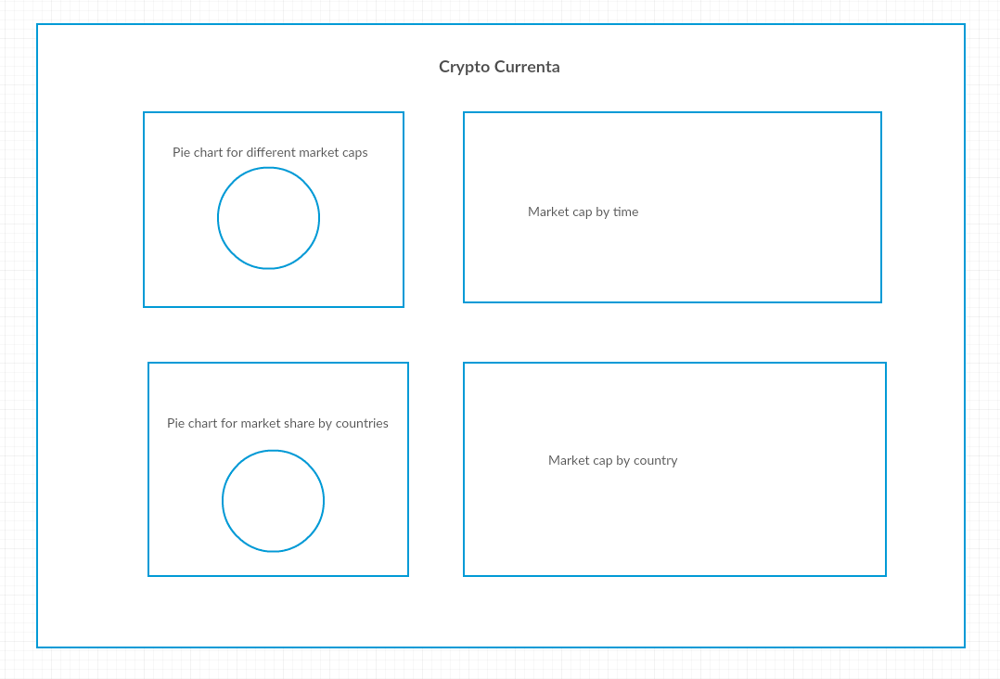

# Crypto-currenta Proposal
***

## Overview
---

Crypto-currenta is a data visualizaion project for crypto currency market. User can inspect the market change through interactive and beautiful charts.
Crypto-currenta will be reading from csv/JSON file as data source. User should be able to check the exchange
volume in certain market(eg. Coinbase) by month, week and day.

## Technologies
---

This project will be implemented with following technologies:

* Vanilla Javascript for data
* Jquery for handling user interaction
* D3.js for visualizaion
* **bonus** JSON formatted data source from external api to dynamically show the market change

File structure:

* docs/
* data/
* lib/
 * entry.js: combined all different charts
 * time.js: draw yearly / monthly / weekly / daily market high, low price.
 * market.js: draw market share change in different countries at different time.
 * exchange.js (bonus): draw registered user accounts change in major crypto currency exchanges by time.
* application.css
* index.html

## MVP
---
- [ ] User will be able to check trading volume in one exchange daily for 30 days.
- [ ] User can check major exchange's market share change at different time.
- [ ] User can switch between different major crypto currencies.

## Wireframe
---

## Timeline
---
### Over weekend
- [ ]  Research the interested data sets and design project
- [ ] Finish proposal
### Day 1
- [ ] Setup all necessary Node modules, including getting webpack up and running.
- [ ] Get D3 installed
- [ ] Create webpack.config.js and package.json.
### Day 2
- [ ] Go through D3 Tutorial
- [ ] Finish basic bar chart practice
### Day 3
- [ ] Complete year / month / week / day view for market change
- [ ] Learn more about D3.js to dynamically change charts by history time point
- [ ] Add user interactions
### Day 4
- [ ] Styling of the charts
- [ ] Add production README.md
### Bonus
- [ ] User external API as data source for more broader data visualizaion.
